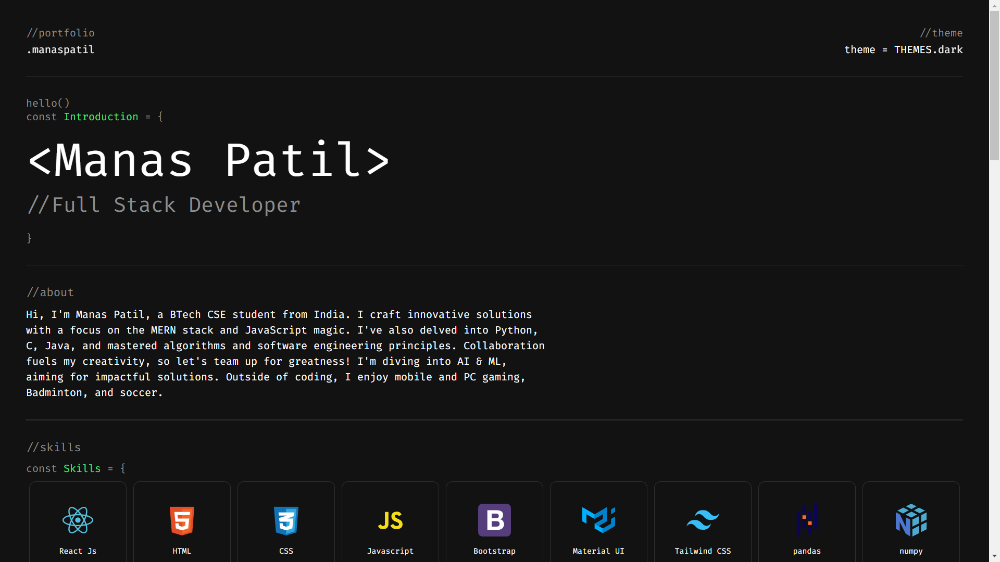

# Manas Patil's Portfolio Website

Welcome to my portfolio website! This repository contains the source code and files for my portfolio website, showcasing my skills and projects as a 2nd year BTech CSE student in Surat, Gujarat, India.

## Accessing the Portfolio Website

You can access my portfolio website by clicking [here](https://patilmanas.netlify.app/). Alternatively, you can copy and paste the following URL into your browser:
https://patilmanas.netlify.app/

## Screenshots

*About*

*Skills*

*Experience*

*Projects*

*Contact*

## Technologies Used

- Frontend: HTML, CSS, JavaScript, styled-components
- Frameworks/Libraries: React.js, Vite.js
- Hosting: Netlify

## Features

- **Responsive Design**: The website is fully responsive and optimized for various screen sizes, including desktops, laptops, tablets, and smartphones.
- **Interactive Elements**: The website includes interactive elements such as buttons, links, and animations to enhance the user experience.
- **Project Showcase**: The Projects section displays information about my projects, including the title, description, technologies used, and links to the live demo and source code.
- **Experience Section**: The Experience section highlights my work experience.
- **Skills Section**: The Skills section highlights my technical skills and proficiencies using icons and progress bars.
- **Contact Form**: The Contact section includes a contact form that allows users to send messages directly to my email address.

## Contributing

If you have suggestions or improvements for my portfolio website, feel free to open an issue or submit a pull request. Your feedback is valuable to me!

## Contact Information

- Email: pmanas13092004@gmail.com
- LinkedIn: [Manas Patil](https://www.linkedin.com/in/manas-patil-876718250/)

## License

This project is licensed under the MIT License. See the [LICENSE](LICENSE) file for details.